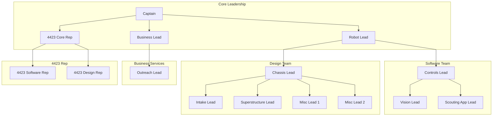

# Purpose
Dedicated student involvement is decreasing or remaining static at a low value. This puts additional strain on the mentors or those students who are committed. We have seen this heavily in the last couple of seasons. We are also missing out on one of the most impactful learning experiences in FRC, leadership. No matter what career a kid chooses and no matter how much the technology changes outside of FRC, the ability to lead a group of people will be beneficial in any stage of life. Right now the team operates with everyone as equals. We have in the past defined "students leaders" but they have no responsibility.

The idea for a team leadership is to try to create a sense of ownership and increase commitment of the students. It can also relieve so of the duties of the mentors. The intent is not to give the students full "technical/design" ownership. The kids don't know how to build robots (thats why they are here) and I'm not suggesting they own that portion. But there is no reason they can't lead a group of individuals as a "project manager". Doesn't even have to be a group they "own" it could be a product like the vision system or MARS/SPARKS.

# Team Org Chart

# Team Roles and Expectations
## Core Leadership
- Captain:
  This student is the team leader or president. They should be the student face of the team. They can lead all team meetings.
- Robot Lead:
  This students is in charge of all robot groups.
- Business Lead:
  This student is the head of the Business Services team, but we want to ensure they have representation in the core leadership.
- 4423 Core Rep:
  This student is the "head" of the 4423 and acts as a voice for JV to the core leadership.

## Software Team
General members of this group will work on all elements of the robot/scouting software as needed. Any student with a software focus will fall under this group.
- Software Lead:
  This student is the lead for the software team. They meet with the software mentors to plan out tasks and report progress to the robot lead.
- Vision Lead:
  This student manages the vision systems for the robot (ML and Localization). They don't "manage" anyone directly, but own the project.
- Scouting App Lead:
  This student manages the scouting system (App and Dashboard). They don't "manage" anyone directly, but own the project.

## Design Team
General members of this group will work on all elements of the design/fab as needed. Any student with a design focus will fall under this group.
- Design Lead:
  This student is the lead for the design team. They meet with the design mentors and the other subsystem leads to plan out tasks and report progress to the robot lead.
- Subsystem Lead X:
  These students are the leads for the given subsystem. They meet with the design mentors and the other subsystem leads to plan out tasks and report progress to the robot lead. However they are more focused on the specific subsystem.

## Business Services
General members of this group will work on all elements of business services. Any student with a business services focus will fall under this group.
- Outreach Lead:
  This student manages the outreach events like K8 programs and MARS/SPARKS. They don't "manage" anyone directly, but own the project.

## 4423 Reps
*These roles can be more flexible and even change weekly if we want. Just a way to get younger students exposed to the leadership structure.*
- 4423 Software Rep: A Software student to act as the lead for the JV software members. They can meet with the software mentors to discuss tasks to be completed.
- 4423 Design Rep: A Design student to act as the lead for the JV design members. They can meet with the design mentors to discuss tasks to be completed.

# FAQ
  - How would we do this? We don't have the kids to fill these roles
    - We never will unless we start. We have done a poor job at teaching leadership skills and that is why there aren't kids to take the spots. It will be a trial by fire for sure, but we just have to rip of the band-aid.

  - What if the kids don't want it?
    - If we determine that the mentors have bought in I propose for a meeting with those prospective leaders to get their opinion on if they would want something like this and what they would want it to look like. From there we would open applications to everyone not just the students in that meeting.

  - How would we pick the leaders?
    - Through an application and interview process. Originally it would have to be just mentors, but in future years it could be the decision between existing/exiting leadership and related mentors.
    - Currently that prospective list would be"
      - Jax Bequette
      - Eli Reutter
      - Nathan Stanley
      - Will Rajtora

  - How are the kids going to make big directional decisions?
    - We aren't going to ask the kids to make decision like "ground pickup design or total robot architecture". The idea is that they just have a seat at the table and are present when mentors are making these decisions. They then relay and "manage" a group/project to complete the concept.

  - How do we handle leadership loops? (Ex. Bill is Robot Lead and a Software Student)
    - Good question. I don't have a great idea at this time. Likely said example student would collaborate with their circular dependency leader and refer to them for assistance while letting them manage their assigned peers.

# Feedback
I reached out to a few more recent alumni and collect some feedback and opinions about the current view. I asked some of the following questions.
- Do you think you personally would have been for something like this? Or would you have liked it to stay how it was?
- And do you think your fellow students would have been for something like this?
- Do you think students would be ok with "reporting" or taking tasks from a fellow student?

### Nathan Evans
- "I do agree that a more defined structure would be helpful."
- "It felt like last year, there were a few people doing the majority of the work, both because they had the most experience with it and they were the most motivated. Having some defined titles would definitely help motivate those people and give them a specific topic to gain experience in. I can definitely imagine some of my peers, in the listed positions. I think it would also make them feel more included, since some times they were bummed not to have a have a drive team title."
- "I think that greatly depends on the student providing the task as well as who it is being received from. I can definitely see students letting a title get to their head. Or only taking tasks/ orders from the person they were assigned to. But I think overall, assuming the students trust that their leader has a good understanding of the project, it would work well."

### Josh Tobben

### Katie Hunt
- "I believe that the team would benefit from having this kind of structure. I feel like the team has struggled with having determined students that care for robotics/the team. I know that my graduating class had several students that would put in the required time and so much more. The years after seemed to struggle with students that cared as much and it showed not only on the robot side but also on the social/volunteer side. I believe if this leadership structure was in place it would help build motivated students and make the team truly what FIRST desires.
- "The leadership roles would help build non-technical skills. The technical knowledge is a lot of what FIRST hopes to give the students but there is a lot to say for someone in the workforce that has soft skills. From my experience, having these soft skills, like leadership is very important when it comes to interviews. I had to interview for my degree program and a lot of questions had to deal with how I work in a team and leadership skills.
Not only would the leadership roles benefit the team and students, but it would also benefit the mentors. Having two family members being mentors, I've witnessed the feelings of frustration about the lack of student involvement. Without that involvement the mentors have to make up for it and it puts more on your mentors that are already volunteering their time."
- "I think the first couple years might be harder for students to report to other students but I think that's just because it will be new and returning students and mentors won't be used to that idea. If you implement this structure I think it would be really important for all the mentors to be in on it because once you have a mentor not follow the structure, then the students think they won't have to follow it either."